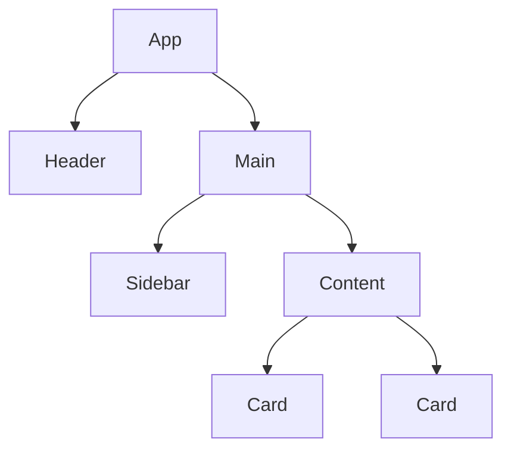
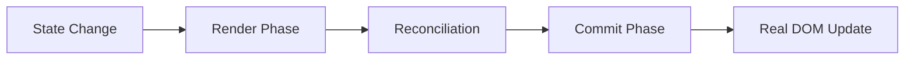
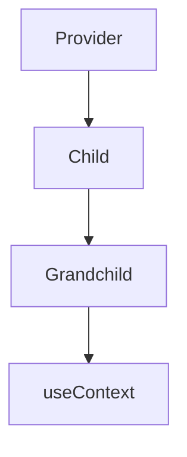

# React Complete Guide

A comprehensive, beginner-to-advanced reference for modern React (React 19+).

**Audience:** Anyone learning React or returning for a refresher.  
**Assumptions:** You know basic HTML, CSS, and JavaScript (ES2023+). Code examples use functional components and hooks unless noted.

---

## Table of Contents

- [1. Introduction](#1-introduction)
- [2. Project Setup](#2-project-setup)
- [3. JSX](#3-jsx)
- [4. Components](#4-components)
- [5. Props](#5-props)
- [6. State](#6-state)
- [7. Event Handling](#7-event-handling)
- [8. Hooks](#8-hooks)
- [9. Effects](#9-effects)
- [10. Forms](#10-forms)
- [11. Conditional Rendering](#11-conditional-rendering)
- [12. Lists](#12-lists)
- [13. Styling](#13-styling)
- [14. Context API](#14-context-api)
- [15. Routing](#15-routing)
- [16. Data Fetching](#16-data-fetching)
- [17. Performance Optimization](#17-performance-optimization)
- [18. Error Handling](#18-error-handling)
- [19. Custom Hooks](#19-custom-hooks)
- [20. Refs](#20-refs)
- [21. Portals](#21-portals)
- [22. Suspense](#22-suspense)
- [23. React Patterns](#23-react-patterns)
- [24. File Organization](#24-file-organization)
- [25. State Management](#25-state-management)
- [26. TypeScript with React](#26-typescript-with-react)
- [27. Testing](#27-testing)
- [28. Accessibility](#28-accessibility)
- [29. Security](#29-security)
- [30. Deployment](#30-deployment)
- [31. React Ecosystem](#31-react-ecosystem)
- [32. Common Mistakes](#32-common-mistakes)
- [33. Best Practices](#33-best-practices)
- [34. Frequently Asked Questions](#34-frequently-asked-questions)
- [35. Cheat Sheet](#35-cheat-sheet)

---

# 1. Introduction

## What is React?

React is a JavaScript library for building user interfaces, especially single-page applications. It lets you compose complex UIs from small, isolated pieces of code called **components**.

## A Short History

React was created by Jordan Walke at Facebook and released as open source in 2013. It introduced the **Virtual DOM** and popularized a component-based, declarative UI model. Major milestones include hooks (2019), the new JSX transform (2020), the concurrent renderer (React 18, 2022), and React 19 with new APIs such as `useActionState` and `useOptimistic`.

## Virtual DOM

The Virtual DOM (VDOM) is a lightweight in-memory representation of the real DOM. When state changes, React builds a new VDOM tree, compares it with the previous tree ("diffing"), and calculates the minimum number of real DOM updates needed. This batching and diffing makes updates efficient.

## React DOM

`react-dom` is the package that renders React elements into the browser DOM. In React 19, `createRoot` is the standard entry point:

```jsx
import { createRoot } from 'react-dom/client';
import App from './App';

createRoot(document.getElementById('root')).render(<App />);
```

## Component-Based Architecture

UIs are built from reusable, self-contained components. Components can be nested, composed, and reused across an application.



## SPA vs MPA

| Feature | Single-Page App (SPA) | Multi-Page App (MPA) |
|---|---|---|
| Page loads | One HTML page, JS handles navigation | Full page reload on navigation |
| Server round-trips | Fewer after initial load | More frequent |
| Use case | Dashboards, web apps | Content sites, e-commerce |

React is commonly used for SPAs, but can also be rendered server-side with frameworks like Next.js or Remix.

## Declarative Programming

Declarative code describes **what** the UI should look like for a given state, rather than **how** to update it step by step. You describe the UI as a function of state, and React handles the DOM updates.

## React Rendering Process

1. A component function runs and returns JSX.
2. React creates a virtual DOM tree.
3. React reconciles the new tree with the previous one.
4. React commits the minimal set of changes to the real DOM.
5. Layout and paint occur in the browser.



> **Note:** React 19's concurrent features can interrupt and prioritize renders to keep the UI responsive.

# 2. Project Setup

## Vite (Recommended)

Vite is the modern, fast build tool for React.

```bash
# npm
npm create vite@latest my-app -- --template react

# pnpm
pnpm create vite my-app -- --template react

# yarn
yarn create vite my-app -- --template react

# bun
bun create vite my-app -- --template react
```

Then:

```bash
cd my-app
npm install
npm run dev
```

## Create React App (Legacy)

```bash
npx create-react-app my-app
```

> **Warning:** `create-react-app` is no longer recommended for new projects. Prefer Vite or a framework.

## Next.js

For production apps needing server-side rendering, static generation, or file-system routing:

```bash
npx create-next-app@latest my-app
```

## Manual Setup

Create `index.html`, `main.jsx`, and install dependencies:

```bash
npm init -y
npm install react react-dom
npm install -D vite @vitejs/plugin-react
```

```html
<!-- index.html -->
<div id="root"></div>
<script type="module" src="/main.jsx"></script>
```

```jsx
// main.jsx
import { createRoot } from 'react-dom/client';
import App from './App.jsx';

createRoot(document.getElementById('root')).render(<App />);
```

## Typical Vite Folder Structure

```
my-app/
├── public/
├── src/
│   ├── assets/
│   ├── components/
│   ├── App.jsx
│   ├── main.jsx
│   └── index.css
├── index.html
├── package.json
└── vite.config.js
```

## Project Organization Tips

- Group files by **feature** in medium/large apps.
- Keep components small and focused on one responsibility.
- Co-locate tests, styles, and utilities near the components that use them.

# 3. JSX

## What is JSX?

JSX is a syntax extension for JavaScript that looks like HTML. It is not required by React, but it makes writing UI components easier.

```jsx
const element = <h1>Hello, world!</h1>;
```

## Expressions

Use curly braces `{}` to embed any JavaScript expression:

```jsx
function Greeting({ name }) {
  return <h1>Hello, {name.toUpperCase()}</h1>;
}
```

## Comments

```jsx
{/* A JSX comment */}
<div>
  {/* Inline comment */}
  <p>Text</p>
</div>
```

## Fragments

Return multiple elements without adding extra DOM nodes:

```jsx
function List() {
  return (
    <>
      <li>One</li>
      <li>Two</li>
    </>
  );
}
```

## Nested Elements

Elements can be nested like HTML. Every opening tag must be closed.

```jsx
function Card({ children }) {
  return (
    <div className="card">
      <h2>Title</h2>
      {children}
    </div>
  );
}
```

## Self-Closing Tags

Tags without children must be self-closing:

```jsx

<input type="text" />
<br />
```

## JSX Rules

- One top-level element per component (use fragments for siblings).
- Use `className` instead of `class`.
- Use `htmlFor` instead of `for`.
- Attributes use camelCase (`onClick`, `readOnly`).

## Conditional Rendering

```jsx
function Greeting({ isLoggedIn }) {
  return <div>{isLoggedIn ? <p>Welcome</p> : <p>Please sign in</p>}</div>;
}

function Banner({ show }) {
  return show && <div className="banner">Sale!</div>;
}
```

## Lists and Keys

```jsx
function TodoList({ todos }) {
  return (
    <ul>
      {todos.map((todo) => (
        <li key={todo.id}>{todo.text}</li>
      ))}
    </ul>
  );
}
```

> **Tip:** Keys should be stable, unique, and not array indices when the order can change.

## Rendering Variables, Functions, Objects, and Arrays

```jsx
function Demo() {
  const count = 5;
  const greet = (name) => `Hi, ${name}`;
  const user = { first: 'Ada', last: 'Lovelace' };
  const colors = ['red', 'green', 'blue'];

  return (
    <section>
      <p>Count: {count}</p>
      <p>{greet('Ada')}</p>
      <p>{user.first} {user.last}</p>
      <p>{colors.join(', ')}</p>
    </section>
  );
}
```

> **Warning:** Do not render objects directly: `{user}` will throw. Render object properties or strings.

## How JSX Becomes JavaScript

Babel or esbuild transforms JSX into `React.createElement` calls (or `_jsx` with the new transform):

```jsx
// JSX
const el = <h1 className="title">Hello</h1>;

// Transformed (new transform)
import { jsx as _jsx } from 'react/jsx-runtime';
const el = _jsx('h1', { className: 'title', children: 'Hello' });
```

> **Note:** The new JSX transform means you no longer need to import `React` just to use JSX.

# 4. Components

## Functional Components

A functional component is a JavaScript function that returns JSX.

```jsx
function Welcome({ name }) {
  return <h1>Hello, {name}</h1>;
}

export default function App() {
  return <Welcome name="Sara" />;
}
```

## Component Composition

Compose small components into larger ones:

```jsx
function App() {
  return (
    <Page>
      <Header />
      <Main>
        <Sidebar />
        <Content />
      </Main>
      <Footer />
    </Page>
  );
}
```

## Reusable Components

Make components reusable by accepting props:

```jsx
function Button({ children, onClick, variant = 'primary' }) {
  return (
    <button className={`btn btn-${variant}`} onClick={onClick}>
      {children}
    </button>
  );
}
```

## Presentational vs Container Components

| Type | Responsibility | State |
|---|---|---|
| Presentational | How things look | Little or none |
| Container | How things work | Holds data and logic |

In modern React, hooks often replace the container pattern.

## Controlled Components

A controlled component's value is driven by React state:

```jsx
function Input() {
  const [value, setValue] = useState('');
  return <input value={value} onChange={(e) => setValue(e.target.value)} />;
}
```

## Uncontrolled Components

Use a ref to read values from the DOM directly:

```jsx
function Form() {
  const inputRef = useRef(null);
  const handleSubmit = () => alert(inputRef.current.value);
  return <input ref={inputRef} />;
}
```

## Pure Components

A pure component returns the same output for the same props and state and has no side effects. `React.memo` memoizes a functional component to avoid unnecessary re-renders.

```jsx
import { memo } from 'react';

const Greeter = memo(function Greeter({ name }) {
  return <p>Hello, {name}</p>;
});
```

## Naming Conventions

- Component file names: `PascalCase.jsx`.
- Component function names: `PascalCase`.
- Props, hooks, and variables: `camelCase`.
- Constants: `SCREAMING_SNAKE_CASE`.

# 5. Props

## Passing Props

Props pass data from parent to child:

```jsx
function Parent() {
  return <Child title="Hello" count={42} />;
}

function Child(props) {
  return (
    <div>
      <h1>{props.title}</h1>
      <p>{props.count}</p>
    </div>
  );
}
```

## Destructuring

```jsx
function Child({ title, count }) {
  return (
    <div>
      <h1>{title}</h1>
      <p>{count}</p>
    </div>
  );
}
```

## Default Values

```jsx
function Button({ type = 'button', children }) {
  return <button type={type}>{children}</button>;
}
```

> **Tip:** Defaults work for `undefined` but not `null`.

## Rest Props

```jsx
function Input({ label, ...inputProps }) {
  return (
    <label>
      {label}
      <input {...inputProps} />
    </label>
  );
}
```

## Spread Props

Use spread to forward an object as props:

```jsx
const user = { name: 'Ada', age: 36 };
<Profile {...user} />
```

> **Warning:** Avoid spreading unknown objects onto DOM elements; it can pass invalid attributes.

## Children Prop

```jsx
function Card({ children }) {
  return <div className="card">{children}</div>;
}

<Card>
  <p>Card content</p>
</Card>
```

## Component as a Prop

```jsx
function Page({ Header, Footer }) {
  return (
    <>
      <Header />
      <main>Content</main>
      <Footer />
    </>
  );
}
```

## Render Props

```jsx
function MouseTracker({ render }) {
  const [position, setPosition] = useState({ x: 0, y: 0 });

  return (
    <div onMouseMove={(e) => setPosition({ x: e.clientX, y: e.clientY })}>
      {render(position)}
    </div>
  );
}

<MouseTracker render={(pos) => <p>{pos.x}, {pos.y}</p>} />
```

## Passing Functions, JSX, Arrays, and Objects

```jsx
function App() {
  const items = ['a', 'b'];
  const user = { name: 'Ada' };
  const log = (msg) => console.log(msg);

  return (
    <Toolbar
      onClick={log}
      items={items}
      user={user}
      header={<h1>App</h1>}
    />
  );
}
```

> **Best Practice:** Keep props as data + callbacks; avoid deeply nested prop drilling by using Context.

# 6. State

## useState

`useState` adds state to functional components.

```jsx
import { useState } from 'react';

function Counter() {
  const [count, setCount] = useState(0);

  return (
    <div>
      <p>{count}</p>
      <button onClick={() => setCount(count + 1)}>+</button>
    </div>
  );
}
```

- **Initial value:** `useState(0)`.
- **Return value:** `[state, setter]` array.
- **Re-render:** Calling the setter triggers a re-render.

## Functional Updates

When the new state depends on the previous state, pass a function:

```jsx
<button onClick={() => setCount((prev) => prev + 1)}>+</button>
```

## Object State

Never mutate state directly. Create a new object:

```jsx
function UserForm() {
  const [user, setUser] = useState({ name: '', age: 0 });

  const updateName = (name) => {
    setUser((prev) => ({ ...prev, name }));
  };

  return <input value={user.name} onChange={(e) => updateName(e.target.value)} />;
}
```

## Array State

```jsx
function TodoList() {
  const [todos, setTodos] = useState([]);

  const addTodo = (text) => {
    setTodos((prev) => [...prev, { id: crypto.randomUUID(), text }]);
  };

  const removeTodo = (id) => {
    setTodos((prev) => prev.filter((t) => t.id !== id));
  };

  return (
    <>
      {todos.map((t) => (
        <div key={t.id}>
          {t.text} <button onClick={() => removeTodo(t.id)}>x</button>
        </div>
      ))}
    </>
  );
}
```

## Nested Updates

For deeply nested state, copy each level:

```jsx
setUser((prev) => ({
  ...prev,
  address: { ...prev.address, city: 'New York' },
}));
```

> **Tip:** Consider flattening state or using a reducer/immutable library for deep structures.

## Immutable Updates

- Use the spread operator for objects and arrays.
- Use `.map`, `.filter`, `.slice` instead of mutating methods.
- For complex updates, use `useReducer` or libraries like Immer.

## Common Mistakes

- Calling `setState` does not update state immediately; it is scheduled.
- Mutating state directly will not trigger re-renders.
- Passing objects/arrays as initial state without a function causes a new object every render: `useState(() => computeDefault())` is safer for expensive computations.

# 7. Event Handling

## Mouse Events

```jsx
function Clicker() {
  const handleClick = (e) => {
    console.log('clicked', e.clientX, e.clientY);
  };

  return <button onClick={handleClick}>Click</button>;
}
```

Other mouse events: `onDoubleClick`, `onMouseEnter`, `onMouseLeave`, `onMouseMove`, `onContextMenu`.

## Keyboard Events

```jsx
function Search() {
  const handleKeyDown = (e) => {
    if (e.key === 'Enter') {
      console.log('Submit');
    }
  };

  return <input onKeyDown={handleKeyDown} />;
}
```

## Form Events

```jsx
function Form() {
  const [value, setValue] = useState('');

  const handleSubmit = (e) => {
    e.preventDefault();
    console.log(value);
  };

  return (
    <form onSubmit={handleSubmit}>
      <input value={value} onChange={(e) => setValue(e.target.value)} />
      <button type="submit">Submit</button>
    </form>
  );
}
```

## Clipboard, Focus, and Drag Events

```jsx
<input
  onCopy={(e) => console.log('copied')}
  onFocus={(e) => console.log('focused')}
  onBlur={(e) => console.log('blurred')}
  onDragStart={(e) => e.dataTransfer.setData('text', 'data')}
/>
```

## Synthetic Events

React wraps browser events in a `SyntheticEvent` to normalize behavior across browsers. It is pooled in older React versions; in React 19+, properties are accessed normally.

## Event Propagation

Events bubble up by default. Call `e.stopPropagation()` to stop bubbling and `e.preventDefault()` to stop default browser behavior.

```jsx
function Outer() {
  return (
    <div onClick={() => console.log('outer')}>
      <button
        onClick={(e) => {
          e.stopPropagation();
          console.log('inner');
        }}
      >
        Click
      </button>
    </div>
  );
}
```

> **Best Practice:** Prefer passing a function reference rather than an inline arrow that creates a new function on every render unless the handler needs parameters.

# 8. Hooks

Hooks let you use state and other React features in functional components. They were introduced in React 16.8 and are the standard in React 19.

## Rules of Hooks

- Only call hooks at the top level of a function component or custom hook.
- Only call hooks from React functions, not from regular JS functions or loops/conditions.
- Use the `eslint-plugin-react-hooks` rules `rules-of-hooks` and `exhaustive-deps`.

### useState

- **Purpose:** Add local state to a component.
- **Syntax:** `const [state, setState] = useState(initialValue);`
- **Parameters:** `initialValue` (or a function returning it).
- **Return value:** `[state, setter]`.

```jsx
function Counter() {
  const [count, setCount] = useState(0);
  return <button onClick={() => setCount((c) => c + 1)}>{count}</button>;
}
```

> **Common mistake:** Mutating state directly does not trigger a re-render.

### useEffect

- **Purpose:** Run side effects after rendering.
- **Syntax:** `useEffect(setup, dependencies?)`
- **Parameters:** a function and an optional dependency array.
- **Return value:** none; the setup function may return a cleanup function.

```jsx
useEffect(() => {
  const handler = () => console.log('resize');
  window.addEventListener('resize', handler);
  return () => window.removeEventListener('resize', handler);
}, []);
```

> **Performance note:** Keep effects focused and dependency arrays accurate to avoid extra runs.

### useMemo

- **Purpose:** Memoize expensive computations.
- **Syntax:** `const result = useMemo(factory, deps);`
- **Return value:** The memoized result.

```jsx
const sorted = useMemo(() => items.sort((a, b) => a - b), [items]);
```

> **Common mistake:** Memoizing trivial calculations costs more than it saves.

### useCallback

- **Purpose:** Return a stable function reference.
- **Syntax:** `const fn = useCallback(callback, deps);`
- **Return value:** Memoized function.

```jsx
const increment = useCallback(() => setCount((c) => c + 1), []);
```

> **Best practice:** Only use `useCallback` when the function is passed to a `React.memo` child or used as a dependency.
## useRef

- **Purpose:** Persist a mutable value across renders without re-rendering.
- **Syntax:** `const ref = useRef(initialValue);`
- **Return value:** `{ current: initialValue }`.

```jsx
function TextInput() {
  const inputRef = useRef(null);
  return (
    <>
      <input ref={inputRef} />
      <button onClick={() => inputRef.current.focus()}>Focus</button>
    </>
  );
}
```

> **Warning:** Do not read or write `ref.current` during render. Use `useEffect` or event handlers.

## useContext

- **Purpose:** Read a value from a React context.
- **Syntax:** `const value = useContext(MyContext);`
- **Return value:** Current context value.

```jsx
const ThemeContext = createContext('light');

function ThemedButton() {
  const theme = useContext(ThemeContext);
  return <button className={theme}>Click</button>;
}
```

> **Performance note:** Context consumers re-render when the context value changes.

## useReducer

- **Purpose:** Manage complex state logic with a reducer.
- **Syntax:** `const [state, dispatch] = useReducer(reducer, initialArg, init?);`
- **Return value:** `[state, dispatch]`.

```jsx
function reducer(state, action) {
  switch (action.type) {
    case 'increment': return { count: state.count + 1 };
    default: return state;
  }
}

function Counter() {
  const [state, dispatch] = useReducer(reducer, { count: 0 });
  return <button onClick={() => dispatch({ type: 'increment' })}>{state.count}</button>;
}
```

> **Best practice:** Use `useReducer` when the next state depends on the previous one in complex ways.

## useLayoutEffect

- **Purpose:** Fire synchronously after all DOM mutations, before paint.
- **Syntax:** Same as `useEffect`.
- **Use case:** Measuring DOM layout and adjusting it before the browser paints.

> **Warning:** `useLayoutEffect` can block visual updates. Prefer `useEffect` unless you need synchronous layout.

## useImperativeHandle

- **Purpose:** Customize the value exposed via a parent ref.
- **Syntax:** `useImperativeHandle(ref, createHandle, deps?);`
- **Return value:** none.

```jsx
import { forwardRef, useImperativeHandle, useRef } from 'react';

const FancyInput = forwardRef(function FancyInput(props, ref) {
  const inputRef = useRef(null);
  useImperativeHandle(ref, () => ({
    focus: () => inputRef.current.focus(),
  }));
  return <input ref={inputRef} />;
});
```

> **Best practice:** Use sparingly. Most interactions can be expressed with props.
## useId

- **Purpose:** Generate stable, unique IDs for accessibility attributes.
- **Syntax:** `const id = useId();`
- **Return value:** A unique string.

```jsx
function Field({ label }) {
  const id = useId();
  return (
    <>
      <label htmlFor={id}>{label}</label>
      <input id={id} />
    </>
  );
}
```

## useTransition

- **Purpose:** Mark a state update as non-urgent to keep the UI responsive.
- **Syntax:** `const [isPending, startTransition] = useTransition();`
- **Return value:** `[boolean, startTransition]`.

```jsx
function Search({ query, onChange }) {
  const [isPending, startTransition] = useTransition();

  const handleChange = (e) => {
    const value = e.target.value;
    startTransition(() => {
      onChange(value);
    });
  };

  return <input onChange={handleChange} />;
}
```

## useDeferredValue

- **Purpose:** Defer updating a part of the UI until the urgent updates are done.
- **Syntax:** `const deferredValue = useDeferredValue(value);`
- **Return value:** A lagging version of the value.

```jsx
function Results({ query }) {
  const deferredQuery = useDeferredValue(query);
  return <SlowList query={deferredQuery} />;
}
```

## useSyncExternalStore

- **Purpose:** Subscribe to an external data store.
- **Syntax:** `const state = useSyncExternalStore(subscribe, getSnapshot, getServerSnapshot?);`

```jsx
function useOnlineStatus() {
  return useSyncExternalStore(
    (callback) => {
      window.addEventListener('online', callback);
      window.addEventListener('offline', callback);
      return () => {
        window.removeEventListener('online', callback);
        window.removeEventListener('offline', callback);
      };
    },
    () => navigator.onLine
  );
}
```

## useInsertionEffect

- **Purpose:** Insert styles before any layout effects read the DOM.
- **Use case:** CSS-in-JS libraries injecting rules.
- **Return value:** none.

## useActionState (React 19)

- **Purpose:** Manage form action state, including pending state.
- **Syntax:** `const [state, formAction, isPending] = useActionState(action, initialState);`

```jsx
function Form() {
  const [state, submit, isPending] = useActionState(async (prev, formData) => {
    const name = formData.get('name');
    await saveName(name);
    return { ok: true };
  }, { ok: false });

  return (
    <form action={submit}>
      <input name="name" />
      <button disabled={isPending}>Save</button>
      {state.ok && <p>Saved!</p>}
    </form>
  );
}
```

## useOptimistic (React 19)

- **Purpose:** Show an optimistic UI while an async action is in flight.
- **Syntax:** `const [optimisticState, addOptimistic] = useOptimistic(state, updateFn);`

```jsx
function Messages({ messages, sendMessage }) {
  const [optimistic, addOptimistic] = useOptimistic(
    messages,
    (state, newMessage) => [...state, { ...newMessage, sending: true }]
  );

  return optimistic.map((m) => <p key={m.id}>{m.text} {m.sending && '...'}</p>);
}
```

> **Best practice:** Use `useTransition` with `useOptimistic` so the UI stays responsive.
# 9. Effects

`useEffect` is the workhorse for side effects in React.

## Dependency Arrays

The dependency array controls when the effect runs:

| Array | Behavior |
|---|---|
| No array | Runs after every render |
| `[]` | Runs once after mount |
| `[a, b]` | Runs when `a` or `b` changes |

## Cleanup

Return a cleanup function to prevent memory leaks:

```jsx
useEffect(() => {
  const id = setInterval(() => setTime((t) => t + 1), 1000);
  return () => clearInterval(id);
}, []);
```

## Infinite Loops

An effect that sets state without proper dependencies causes an infinite loop:

```jsx
// Bad: no dependency array
useEffect(() => {
  setCount(count + 1);
});
```

## Fetching Data

```jsx
useEffect(() => {
  const controller = new AbortController();

  async function fetchData() {
    try {
      const res = await fetch('/api/user', { signal: controller.signal });
      const data = await res.json();
      setUser(data);
    } catch (err) {
      if (err.name !== 'AbortError') setError(err);
    }
  }

  fetchData();
  return () => controller.abort();
}, []);
```

## Timers

- Use `setTimeout` or `setInterval` and clear them on cleanup.
- Prefer `requestAnimationFrame` for animations.

## Event Listeners

Attach and detach in the same effect:

```jsx
useEffect(() => {
  const handler = (e) => console.log(e.key);
  window.addEventListener('keydown', handler);
  return () => window.removeEventListener('keydown', handler);
}, []);
```

## Race Conditions

Race conditions happen when an earlier request finishes after a later one. Use an `AbortController` or a flag:

```jsx
useEffect(() => {
  let cancelled = false;
  fetchUser().then((data) => {
    if (!cancelled) setUser(data);
  });
  return () => { cancelled = true; };
}, [userId]);
```

> **Best practice:** Keep effects focused on a single concern and keep dependency arrays honest with the ESLint rule `exhaustive-deps`.

# 10. Forms

## Controlled Forms

Input values are stored in React state:

```jsx
function ControlledForm() {
  const [name, setName] = useState('');

  const handleSubmit = (e) => {
    e.preventDefault();
    console.log(name);
  };

  return (
    <form onSubmit={handleSubmit}>
      <input value={name} onChange={(e) => setName(e.target.value)} />
      <button type="submit">Submit</button>
    </form>
  );
}
```

## Uncontrolled Forms

Use `defaultValue` and read from the DOM:

```jsx
function UncontrolledForm() {
  const inputRef = useRef(null);

  const handleSubmit = (e) => {
    e.preventDefault();
    console.log(inputRef.current.value);
  };

  return (
    <form onSubmit={handleSubmit}>
      <input defaultValue="Ada" ref={inputRef} />
      <button type="submit">Submit</button>
    </form>
  );
}
```

## Multiple Inputs

Use a single state object or computed property names:

```jsx
function MultiInput() {
  const [values, setValues] = useState({ first: '', last: '' });

  const handleChange = (e) => {
    const { name, value } = e.target;
    setValues((prev) => ({ ...prev, [name]: value }));
  };

  return (
    <>
      <input name="first" value={values.first} onChange={handleChange} />
      <input name="last" value={values.last} onChange={handleChange} />
    </>
  );
}
```

## Checkbox

```jsx
function Subscribe() {
  const [agree, setAgree] = useState(false);
  return (
    <label>
      <input type="checkbox" checked={agree} onChange={(e) => setAgree(e.target.checked)} />
      I agree
    </label>
  );
}
```

## Radio

```jsx
function ColorPicker() {
  const [color, setColor] = useState('red');
  return ['red', 'green', 'blue'].map((c) => (
    <label key={c}>
      <input
        type="radio"
        value={c}
        checked={color === c}
        onChange={(e) => setColor(e.target.value)}
      />
      {c}
    </label>
  ));
}
```

## Select

```jsx
function Select({ options }) {
  const [value, setValue] = useState('');
  return (
    <select value={value} onChange={(e) => setValue(e.target.value)}>
      {options.map((o) => (
        <option key={o.value} value={o.value}>{o.label}</option>
      ))}
    </select>
  );
}
```

## Textarea

```jsx
<textarea value={bio} onChange={(e) => setBio(e.target.value)} />
```

## File Uploads

```jsx
function Uploader() {
  const [file, setFile] = useState(null);

  const handleChange = (e) => {
    setFile(e.target.files[0]);
  };

  return <input type="file" onChange={handleChange} />;
}
```

## Validation

Validate on submit or on blur:

```jsx
const isValid = formData.email.includes('@');
```

> **Best practice:** For complex forms, use libraries like React Hook Form or Formik to reduce boilerplate.

# 11. Conditional Rendering

## `if` Statement

Use `if` outside JSX for full branches:

```jsx
function Greeting({ isLoggedIn }) {
  if (isLoggedIn) {
    return <p>Welcome back</p>;
  }
  return <p>Please sign in</p>;
}
```

## Ternary Operator

Best for choosing between two elements inline:

```jsx
function Status({ isOnline }) {
  return <span>{isOnline ? 'Online' : 'Offline'}</span>;
}
```

## Logical `&&`

Render something only when a condition is true:

```jsx
function Banner({ error }) {
  return <div>{error && <p className="error">{error}</p>}</div>;
}
```

> **Warning:** `count && <p>{count}</p>` will render `0` when `count` is 0. Use `count > 0 && ...` or `Boolean(count) && ...`.

## `switch` Statement

```jsx
function Notification({ type }) {
  switch (type) {
    case 'success': return <p>Done!</p>;
    case 'error': return <p>Failed!</p>;
    default: return null;
  }
}
```

## Lookup Object

```jsx
const icons = {
  success: <SuccessIcon />,
  error: <ErrorIcon />,
  warning: <WarningIcon />,
};

function Icon({ type }) {
  return <span>{icons[type] || null}</span>;
}
```

## Early Return

```jsx
function Profile({ user }) {
  if (!user) return <p>Loading...</p>;
  return <h1>{user.name}</h1>;
}
```

> **Best practice:** Choose the most readable approach for the situation. `if` for full branches, ternary for inline choices, `&&` for guard clauses.

# 12. Lists

## Rendering with `map()`

```jsx
function Names({ names }) {
  return (
    <ul>
      {names.map((name) => (
        <li key={name.id}>{name.label}</li>
      ))}
    </ul>
  );
}
```

## Keys

Keys help React identify which items changed. Use a stable identifier, never the array index unless the list is static.

## Filtering

```jsx
{users.filter((u) => u.active).map((u) => <p key={u.id}>{u.name}</p>)}
```

## Sorting

```jsx
{[...users].sort((a, b) => a.name.localeCompare(b.name)).map((u) => (
  <p key={u.id}>{u.name}</p>
))}
```

> **Tip:** Copy the array before sorting; `.sort()` mutates the original.

## Grouping

```jsx
const grouped = tasks.reduce((acc, task) => {
  acc[task.status] = acc[task.status] || [];
  acc[task.status].push(task);
  return acc;
}, {});

Object.entries(grouped).map(([status, items]) => (
  <section key={status}>
    <h3>{status}</h3>
    {items.map((i) => <p key={i.id}>{i.title}</p>)}
  </section>
));
```

> **Performance note:** Pre-compute filtered/sorted data with `useMemo` if the list is large or the operation is expensive.

# 13. Styling

## Global CSS

Import a regular CSS file for global styles:

```jsx
import './index.css';
```

## CSS Modules

CSS Modules scope styles locally to a component:

```jsx
import styles from './Button.module.css';

function Button() {
  return <button className={styles.primary}>Click</button>;
}
```

```css
/* Button.module.css */
.primary {
  background: blue;
  color: white;
}
```

## Inline Styles

```jsx
function Box() {
  return <div style={{ backgroundColor: 'red', padding: '1rem' }}>Box</div>;
}
```

> **Tip:** Use inline styles sparingly; they cannot handle pseudo-classes or media queries.

## Tailwind CSS

Utility-first CSS framework:

```jsx
function Card({ children }) {
  return <div className="rounded bg-white p-4 shadow">{children}</div>;
}
```

Install with Vite:

```bash
npm install -D tailwindcss postcss autoprefixer
npx tailwindcss init -p
```

## Styled Components

CSS-in-JS library:

```jsx
import styled from 'styled-components';

const Button = styled.button`
  background: blue;
  color: white;
`;
```

## Emotion

```jsx
/** @jsxImportSource @emotion/react */
import { css } from '@emotion/react';

const style = css`color: hotpink;`;

function Pink() {
  return <p css={style}>Pink</p>;
}
```

## Sass

```bash
npm install -D sass
```

```scss
/* App.scss */
$primary: #333;
.app { color: $primary; }
```

## Best Practices

- Prefer CSS Modules or Tailwind for component styles.
- Avoid deeply nested selectors.
- Co-locate styles near the component that uses them.
- Use CSS custom properties for theming.

# 14. Context API

Context provides a way to pass data through the component tree without prop drilling.

## createContext

```jsx
import { createContext } from 'react';

const ThemeContext = createContext('light');
```

## Provider

```jsx
function App() {
  return (
    <ThemeContext.Provider value="dark">
      <Toolbar />
    </ThemeContext.Provider>
  );
}
```

## Consumer (legacy)

```jsx
<ThemeContext.Consumer>
  {(theme) => <p>{theme}</p>}
</ThemeContext.Consumer>
```

## useContext

```jsx
function ThemedButton() {
  const theme = useContext(ThemeContext);
  return <button className={theme}>Click</button>;
}
```



## Multiple Contexts

```jsx
function App() {
  return (
    <ThemeContext.Provider value="dark">
      <UserContext.Provider value={user}>
        <Layout />
      </UserContext.Provider>
    </ThemeContext.Provider>
  );
}
```

> **Performance note:** All consumers re-render when the context value changes. Keep context values stable or split contexts by concern.

# 15. Routing

## Installation

```bash
npm install react-router-dom
```

## BrowserRouter

```jsx
import { BrowserRouter, Routes, Route } from 'react-router-dom';

function App() {
  return (
    <BrowserRouter>
      <Routes>
        <Route path="/" element={<Home />} />
        <Route path="/about" element={<About />} />
      </Routes>
    </BrowserRouter>
  );
}
```

## Link and NavLink

```jsx
import { Link, NavLink } from 'react-router-dom';

function Nav() {
  return (
    <nav>
      <Link to="/">Home</Link>
      <NavLink to="/about" className={({ isActive }) => isActive ? 'active' : ''}>
        About
      </NavLink>
    </nav>
  );
}
```

## Outlet and Nested Routes

```jsx
function Dashboard() {
  return (
    <div>
      <Sidebar />
      <Outlet />
    </div>
  );
}

<Route path="/dashboard" element={<Dashboard />}>
  <Route path="stats" element={<Stats />} />
  <Route path="settings" element={<Settings />} />
</Route>
```

## Parameters

```jsx
import { useParams } from 'react-router-dom';

function User() {
  const { id } = useParams();
  return <p>User {id}</p>;
}

<Route path="/user/:id" element={<User />} />
```

## Query Strings

```jsx
import { useSearchParams } from 'react-router-dom';

function Search() {
  const [params, setParams] = useSearchParams();
  const query = params.get('q') || '';

  return <input value={query} onChange={(e) => setParams({ q: e.target.value })} />;
}
```

## Programmatic Navigation

```jsx
import { useNavigate } from 'react-router-dom';

function Login() {
  const navigate = useNavigate();

  const handleLogin = () => {
    // ... auth logic
    navigate('/dashboard');
  };

  return <button onClick={handleLogin}>Log in</button>;
}
```

## Protected Routes

```jsx
function Protected({ children }) {
  const isAuth = useAuth();
  return isAuth ? children : <Navigate to="/login" />;
}

<Route path="/admin" element={<Protected><Admin /></Protected>} />
```

## Lazy Routes

```jsx
const About = lazy(() => import('./About'));

<Route path="/about" element={<Suspense fallback={<Spinner />}><About /></Suspense>} />
```

# 16. Data Fetching

## fetch()

```jsx
useEffect(() => {
  async function load() {
    const res = await fetch('/api/items');
    const data = await res.json();
    setItems(data);
  }
  load();
}, []);
```

## Axios

```bash
npm install axios
```

```jsx
import axios from 'axios';

useEffect(() => {
  axios.get('/api/items').then((res) => setItems(res.data));
}, []);
```

## Loading and Error States

```jsx
function UserList() {
  const [users, setUsers] = useState([]);
  const [loading, setLoading] = useState(true);
  const [error, setError] = useState(null);

  useEffect(() => {
    fetch('/api/users')
      .then((res) => res.json())
      .then(setUsers)
      .catch(setError)
      .finally(() => setLoading(false));
  }, []);

  if (loading) return <p>Loading...</p>;
  if (error) return <p>Error: {error.message}</p>;
  return <ul>{users.map((u) => <li key={u.id}>{u.name}</li>)}</ul>;
}
```

## Caching and Retries

- Caching: Store fetched data in state, context, or a cache layer.
- Retries: Use a retry wrapper or libraries like `axios-retry`.

## TanStack Query and SWR

For production apps, prefer dedicated data-fetching libraries:

```bash
npm install @tanstack/react-query
```

```jsx
import { useQuery } from '@tanstack/react-query';

function Users() {
  const { data, isLoading, error } = useQuery({
    queryKey: ['users'],
    queryFn: () => fetch('/api/users').then((r) => r.json()),
  });

  if (isLoading) return <p>Loading...</p>;
  if (error) return <p>Error</p>;
  return <ul>{data.map((u) => <li key={u.id}>{u.name}</li>)}</ul>;
}
```

> **Best practice:** Avoid fetching in `useEffect` when a library like TanStack Query can handle caching, background updates, and deduplication.

# 17. Performance Optimization

## React.memo

Memoize a component to skip re-renders when props have not changed:

```jsx
import { memo } from 'react';

const ExpensiveItem = memo(function ExpensiveItem({ data }) {
  return <div>{data.name}</div>;
});
```

> **Tip:** `React.memo` only compares props shallowly.

## useMemo

Cache expensive calculations:

```jsx
const total = useMemo(() => items.reduce((sum, i) => sum + i.price, 0), [items]);
```

## useCallback

Prevent child re-renders by passing stable callbacks:

```jsx
const handleDelete = useCallback((id) => {
  setItems((prev) => prev.filter((i) => i.id !== id));
}, []);

<ExpensiveList items={items} onDelete={handleDelete} />
```

## Code Splitting

Split bundles by route or feature:

```jsx
const Dashboard = lazy(() => import('./Dashboard'));
```

## Lazy Loading

Use `React.lazy` and `Suspense` to defer loading until needed:

```jsx
import { Suspense, lazy } from 'react';

const Chart = lazy(() => import('./Chart'));

function Report() {
  return (
    <Suspense fallback={<Spinner />}>
      <Chart />
    </Suspense>
  );
}
```

## Suspense

`Suspense` lets components wait for something to load and show a fallback.

```jsx
<Suspense fallback={<Loading />}>
  <LazyComponent />
</Suspense>
```

## Image Optimization

- Use modern formats (WebP/AVIF).
- Lazy load images below the fold with `loading="lazy"`.
- Provide `width` and `height` to avoid layout shift.

## Bundle Optimization

- Tree-shake unused code.
- Use dynamic imports.
- Analyze bundles with tools like `vite-bundle-visualizer` or `@next/bundle-analyzer`.

## Re-render Optimization

- Lift state down when possible.
- Pass primitives instead of objects to memoized children.
- Use `useMemo`/`useCallback` only where they provide measurable benefit.
- Avoid inline object/array creation in render for memoized children.

> **Warning:** Premature optimization is a common trap. Profile first with React DevTools Profiler.

# 18. Error Handling

## Error Boundaries

Error boundaries catch JavaScript errors in child components. They must be class components. In React 19, use a library like `react-error-boundary`:

```bash
npm install react-error-boundary
```

```jsx
import { ErrorBoundary } from 'react-error-boundary';

function Fallback({ error, resetErrorBoundary }) {
  return (
    <div>
      <p>Something went wrong: {error.message}</p>
      <button onClick={resetErrorBoundary}>Try again</button>
    </div>
  );
}

<ErrorBoundary FallbackComponent={Fallback}>
  <App />
</ErrorBoundary>
```

## try/catch

Use `try/catch` for synchronous errors and async operations:

```jsx
async function fetchUser() {
  try {
    const res = await fetch('/api/user');
    return await res.json();
  } catch (err) {
    console.error(err);
    return null;
  }
}
```

## Async Errors

`try/catch` works with `await`. For `.then()`/`.catch()`, use the `.catch` method.

```jsx
fetch('/api/user')
  .then((res) => res.json())
  .catch((err) => setError(err));
```

## Fallback UI

A fallback UI is shown when an error boundary catches an error. It should:
- Explain what happened.
- Provide a way to recover or reload.
- Avoid exposing sensitive details in production.

# 19. Custom Hooks

## Creating Hooks

A custom hook is a function that starts with `use` and can call other hooks.

```jsx
function useWindowWidth() {
  const [width, setWidth] = useState(window.innerWidth);

  useEffect(() => {
    const handleResize = () => setWidth(window.innerWidth);
    window.addEventListener('resize', handleResize);
    return () => window.removeEventListener('resize', handleResize);
  }, []);

  return width;
}
```

## Naming

- Always start with `use`.
- Name by what it returns or does: `useOnlineStatus`, `useFetch`.

## Reusability

Custom hooks should be:
- Self-contained.
- Not tied to a specific component.
- Clear about inputs and outputs.

## Example: useLocalStorage

```jsx
function useLocalStorage(key, initialValue) {
  const [stored, setStored] = useState(() => {
    try {
      const item = window.localStorage.getItem(key);
      return item ? JSON.parse(item) : initialValue;
    } catch {
      return initialValue;
    }
  });

  const setValue = (value) => {
    try {
      setStored(value);
      window.localStorage.setItem(key, JSON.stringify(value));
    } catch (err) {
      console.error(err);
    }
  };

  return [stored, setValue];
}
```

> **Best practice:** Extract repeated logic into custom hooks to keep components clean and testable.

# 20. Refs

## Accessing DOM Nodes

Refs are the escape hatch to access DOM nodes directly:

```jsx
function TextInput() {
  const inputRef = useRef(null);

  return (
    <>
      <input ref={inputRef} />
      <button onClick={() => inputRef.current.focus()}>Focus</button>
    </>
  );
}
```

## Storing Mutable Values

A ref can store any value without causing re-renders:

```jsx
function Timer() {
  const countRef = useRef(0);

  useEffect(() => {
    const id = setInterval(() => {
      countRef.current += 1;
      console.log(countRef.current);
    }, 1000);
    return () => clearInterval(id);
  }, []);

  return <p>Check the console</p>;
}
```

## Previous Values

```jsx
function usePrevious(value) {
  const ref = useRef(value);
  useEffect(() => {
    ref.current = value;
  }, [value]);
  return ref.current;
}
```

## Refs vs State

| Use case | Ref | State |
|---|---|---|
| DOM access | Yes | No |
| Re-render on change | No | Yes |
| Persist across renders | Yes | Yes |

## Forwarding Refs

```jsx
import { forwardRef, useRef } from 'react';

const CustomInput = forwardRef(function CustomInput(props, ref) {
  return <input ref={ref} {...props} />;
});

function Parent() {
  const inputRef = useRef(null);
  return <CustomInput ref={inputRef} />;
}
```

> **Best practice:** Avoid overusing refs. Most UI interactions should be driven by state and props.

# 21. Portals

A portal renders a child into a different part of the DOM, while keeping it in the same React component tree.

## Why Use Portals?

- Modals
- Tooltips
- Dropdowns that need to escape `overflow: hidden` parents

## createPortal

```jsx
import { createPortal } from 'react-dom';

function Modal({ children, onClose }) {
  return createPortal(
    <div className="modal-backdrop" onClick={onClose}>
      <div className="modal">{children}</div>
    </div>,
    document.getElementById('modal-root')
  );
}
```

## Event Bubbling

Events still bubble up through the React tree, even though the DOM node is elsewhere.

```jsx
function App() {
  return (
    <div onClick={() => console.log('app')}>
      <Modal onClose={() => {}}>
        <button>Click me</button>
      </Modal>
    </div>
  );
}
```

> **Note:** Create a dedicated container element in `index.html` for portals, such as `<div id="modal-root"></div>`.

# 22. Suspense

`Suspense` lets a component wait for code or data to load and display a fallback.

## Basic Usage with lazy()

```jsx
import { Suspense, lazy } from 'react';

const Profile = lazy(() => import('./Profile'));

function App() {
  return (
    <Suspense fallback={<p>Loading profile...</p>}>
      <Profile />
    </Suspense>
  );
}
```

## Fallback

The `fallback` prop accepts any React element:

```jsx
<Suspense fallback={<Spinner />}>
  <Page />
</Suspense>
```

## Nested Suspense

```jsx
<Suspense fallback={<PageSkeleton />}>
  <Header />
  <Suspense fallback={<ChartSkeleton />}>
    <Chart />
  </Suspense>
</Suspense>
```

## Data Fetching with Suspense

React 18+ supports data fetching libraries that integrate with Suspense. In React 19, `use` can read resources inside render.

```jsx
function User({ userPromise }) {
  const user = use(userPromise);
  return <h1>{user.name}</h1>;
}
```

> **Best practice:** Pair Suspense boundaries with error boundaries to handle both loading and error states.

# 23. React Patterns

## Compound Components

Components that work together to form a complete UI:

```jsx
function Tabs({ children }) {
  const [active, setActive] = useState(0);
  return <div className="tabs">{children}</div>;
}

Tabs.Panel = function Panel({ children }) {
  return <div className="panel">{children}</div>;
};

<Tabs>
  <Tabs.Panel>One</Tabs.Panel>
  <Tabs.Panel>Two</Tabs.Panel>
</Tabs>
```

> **Best practice:** Use Context to share state between compound components.

## Provider Pattern

Wrap the app with one or more providers to make data available anywhere:

```jsx
function Providers({ children }) {
  return (
    <ThemeProvider>
      <UserProvider>
        {children}
      </UserProvider>
    </ThemeProvider>
  );
}
```

## Higher-Order Components (HOC)

A HOC is a function that takes a component and returns a new component:

```jsx
function withAuth(Component) {
  return function Wrapped(props) {
    const isAuth = useAuth();
    return isAuth ? <Component {...props} /> : <Navigate to="/login" />;
  };
}

export default withAuth(Dashboard);
```

> **Note:** HOCs are less common now; hooks and render props often replace them.

## Render Props

A component receives a function prop that returns JSX:

```jsx
function Toggle({ render }) {
  const [on, setOn] = useState(false);
  return render({ on, toggle: () => setOn((o) => !o) });
}

<Toggle render={({ on, toggle }) => (
  <button onClick={toggle}>{on ? 'On' : 'Off'}</button>
)} />
```

## Hooks Pattern

Encapsulate reusable logic in custom hooks:

```jsx
function useCounter(initial = 0) {
  const [count, setCount] = useState(initial);
  const increment = () => setCount((c) => c + 1);
  const decrement = () => setCount((c) => c - 1);
  return { count, increment, decrement };
}
```

## Container/Presentational Pattern

- **Container:** Fetches and manages data.
- **Presentational:** Receives data via props and renders UI.

```jsx
function UserContainer() {
  const user = useUser();
  return <UserProfile user={user} />;
}

function UserProfile({ user }) {
  return <h1>{user.name}</h1>;
}
```

> **Best practice:** Modern React tends to combine these responsibilities using hooks inside small components.

# 24. File Organization

## Small Projects

```
src/
├── components/
├── App.jsx
├── main.jsx
└── index.css
```

## Medium Projects

Group by feature or by type:

```
src/
├── components/
├── hooks/
├── pages/
├── services/
├── utils/
├── App.jsx
└── main.jsx
```

## Large / Enterprise Projects

Use feature-based folders that contain everything related to a feature:

```
src/
├── features/
│   ├── auth/
│   │   ├── components/
│   │   ├── hooks/
│   │   ├── services/
│   │   └── index.js
│   └── dashboard/
├── shared/
│   ├── components/
│   ├── hooks/
│   └── utils/
├── App.jsx
└── main.jsx
```

## Feature-Based Architecture

Each feature owns its components, tests, styles, and state. Shared code lives in a `shared` folder.

> **Best practice:** Avoid deep folder nesting. Aim for a structure where related files are close together.

# 25. State Management

## When to Use Built-in State vs External Libraries

- **useState/useReducer:** Local component state.
- **Context:** Theme, auth, locale; avoid for high-frequency updates.
- **External library:** Complex global state, caching, derived state, time-travel debugging.

## Overview of Options

| Library | Style | Best For |
|---|---|---|
| Context API | Built-in, prop-like | Low-frequency, widely shared data |
| Redux Toolkit | Explicit actions/reducers | Complex apps, dev tools, middleware |
| Zustand | Minimal stores | Simple global state without boilerplate |
| Jotai | Atomic state | Fine-grained, derived atoms |
| MobX | Observable/proxy-based | OOP style, auto-tracking |
| Recoil | Atoms/selectors | Experimental, now in maintenance mode |

## Zustand Example

```bash
npm install zustand
```

```jsx
import { create } from 'zustand';

const useStore = create((set) => ({
  count: 0,
  increment: () => set((state) => ({ count: state.count + 1 })),
}));

function Counter() {
  const { count, increment } = useStore();
  return <button onClick={increment}>{count}</button>;
}
```

## Redux Toolkit Example

```bash
npm install @reduxjs/toolkit react-redux
```

```jsx
import { configureStore, createSlice } from '@reduxjs/toolkit';
import { Provider, useDispatch, useSelector } from 'react-redux';

const counterSlice = createSlice({
  name: 'counter',
  initialState: { value: 0 },
  reducers: {
    increment: (state) => { state.value += 1; },
  },
});

const store = configureStore({ reducer: { counter: counterSlice.reducer } });

function Counter() {
  const count = useSelector((s) => s.counter.value);
  const dispatch = useDispatch();
  return <button onClick={() => dispatch(counterSlice.actions.increment())}>{count}</button>;
}
```

> **Best practice:** Start with `useState`/`useReducer` and Context. Reach for external libraries only when the complexity justifies it.

# 26. TypeScript with React

## Typing Props

```tsx
type ButtonProps = {
  children: React.ReactNode;
  onClick?: () => void;
  disabled?: boolean;
};

function Button({ children, onClick, disabled }: ButtonProps) {
  return <button onClick={onClick} disabled={disabled}>{children}</button>;
}
```

## Interfaces vs Types

- **Interfaces** can be merged and extended with `extends`.
- **Types** are more flexible for unions and mapped types.

```tsx
interface User {
  id: string;
  name: string;
}

type Status = 'loading' | 'success' | 'error';
```

## Function Component Types

```tsx
import type { FC } from 'react';

const Header: FC<{ title: string }> = ({ title }) => <h1>{title}</h1>;
```

> **Tip:** Using `FC` is optional; many prefer plain function types for props.

## Event Typing

```tsx
function Form() {
  const handleChange = (e: React.ChangeEvent<HTMLInputElement>) => {
    console.log(e.target.value);
  };

  const handleSubmit = (e: React.FormEvent<HTMLFormElement>) => {
    e.preventDefault();
  };

  return (
    <form onSubmit={handleSubmit}>
      <input onChange={handleChange} />
    </form>
  );
}
```

## Generic Components

```tsx
type ListProps<T> = {
  items: T[];
  renderItem: (item: T) => React.ReactNode;
};

function List<T>({ items, renderItem }: ListProps<T>) {
  return <ul>{items.map((item, i) => <li key={i}>{renderItem(item)}</li>)}</ul>;
}
```

## Ref Typing

```tsx
import { useRef } from 'react';

function Input() {
  const inputRef = useRef<HTMLInputElement>(null);

  const focus = () => inputRef.current?.focus();

  return <input ref={inputRef} />;
}
```

## Best Practices

- Prefer `type` for props; use `interface` for object shapes that may be extended.
- Avoid `any`. Use `unknown` when the type is truly unknown.
- Use `React.ReactNode` for children and `React.ElementType` for component props.
- Enable strict mode in `tsconfig.json`.

# 27. Testing

## React Testing Library

Tests behavior from the user's perspective:

```bash
npm install -D @testing-library/react @testing-library/jest-dom
```

```jsx
import { render, screen, fireEvent } from '@testing-library/react';

test('increments count', () => {
  render(<Counter />);
  const button = screen.getByRole('button', { name: /increment/i });
  fireEvent.click(button);
  expect(screen.getByText('1')).toBeInTheDocument();
});
```

## Jest

Jest is a common test runner for React. Use `jest-environment-jsdom` to test DOM behavior.

## Vitest

```bash
npm install -D vitest jsdom @testing-library/react
```

```js
// vitest.config.js
export default {
  test: {
    environment: 'jsdom',
  },
};
```

## Mocking

```jsx
jest.mock('./api', () => ({
  fetchUser: () => Promise.resolve({ name: 'Ada' }),
}));
```

## Snapshot Testing

```jsx
import renderer from 'react-test-renderer';

const tree = renderer.create(<App />).toJSON();
expect(tree).toMatchSnapshot();
```

> **Best practice:** Focus on user-facing behavior rather than implementation details. Use snapshots sparingly.

# 28. Accessibility (a11y)

## Semantic HTML

Use the correct HTML element for its purpose:

```jsx
<button onClick={handleClick}>Submit</button>
```

## Labels and ARIA

```jsx
<label htmlFor="email">Email</label>
<input id="email" type="email" aria-required="true" />
```

## Keyboard Navigation

- Ensure all interactive elements are focusable.
- Support `Enter` and `Space` for custom buttons.
- Trap focus inside modals.

## Focus Management

```jsx
const modalRef = useRef(null);
useEffect(() => modalRef.current?.focus(), []);
```

## Color and Contrast

- Maintain a contrast ratio of at least 4.5:1 for normal text.
- Do not rely on color alone to convey information.

## Testing a11y

Use tools like `axe-core` or `@axe-core/react` to catch accessibility issues.

> **Best practice:** Accessibility benefits all users and improves SEO.

# 29. Security

## XSS

XSS (Cross-Site Scripting) injects malicious scripts into your app. React escapes content by default, but avoid:

```jsx
// Dangerous
<div dangerouslySetInnerHTML={{ __html: userInput }} />
```

## dangerouslySetInnerHTML

Only use when necessary, and sanitize content first with a library like DOMPurify:

```bash
npm install dompurify
```

```jsx
import DOMPurify from 'dompurify';

<div dangerouslySetInnerHTML={{ __html: DOMPurify.sanitize(rawHtml) }} />
```

## Environment Variables

Store secrets in environment variables, not in the client bundle. In Vite, only variables prefixed with `VITE_` are exposed to the client.

```env
VITE_API_URL=https://api.example.com
```

## Authentication and Authorization

- Use secure, httpOnly cookies or secure token storage.
- Verify permissions on the server, not just the client.
- Protect routes with authentication checks.

> **Best practice:** Treat the client as untrusted. Always validate sensitive operations on the server.

# 30. Deployment

## Vercel

```bash
npx vercel
```

Vercel offers zero-config deployments for React and Next.js with automatic previews for pull requests.

## Netlify

```bash
npm install -g netlify-cli
netlify deploy --prod
```

Connect your Git repository for continuous deployment.

## GitHub Pages

Use the `gh-pages` package or GitHub Actions to deploy a static build:

```bash
npm install -D gh-pages
npm run build
npx gh-pages -d dist
```

## Docker

```dockerfile
FROM node:20-alpine AS builder
WORKDIR /app
COPY . .
RUN npm install && npm run build

FROM nginx:alpine
COPY --from=builder /app/dist /usr/share/nginx/html
```

> **Best practice:** Use environment-specific builds and avoid committing secrets to version control.

# 31. React Ecosystem

## Next.js

A React framework for production with SSR, SSG, and API routes.

## Remix

A framework focused on web standards, server-side rendering, and nested routing.

## Expo and React Native

Expo is a framework and platform for universal React applications, including iOS and Android via React Native.

## Electron

Build cross-platform desktop applications with React, HTML, and Node.js.

## Choosing the Right Tool

| Goal | Tool |
|---|---|
| Static marketing site | Next.js, Astro |
| Full-stack web app | Next.js, Remix |
| Mobile app | React Native / Expo |
| Desktop app | Electron |

# 32. Common Mistakes

## 1-25

1. **Mutating state directly.** Always create new objects/arrays.
2. **Using array index as a key** for lists that can reorder.
3. **Forgetting cleanup** in `useEffect` for subscriptions/timers.
4. **Missing dependencies** in `useEffect` dependency arrays.
5. **Calling `setState` directly in render** without a condition.
6. **Using objects/arrays as initial state** without a lazy initializer.
7. **Reading `ref.current` during render.** Use refs in effects/events.
8. **Forgetting the `key` prop** when rendering lists.
9. **Passing object literals** to memoized children on every render.
10. **Creating inline functions** for memoized children without `useCallback`.
11. **Overusing `useMemo`/`useCallback`** for trivial values.
12. **Not handling async errors** in `try/catch` or `.catch`.
13. **Calling an async function directly in `useEffect`.** Use an inner async function.
14. **Not using `AbortController`** for cancellable requests.
15. **Modifying props.** Props are read-only.
16. **Not lifting state up** when siblings need shared data.
17. **Prop drilling** instead of using Context for deep sharing.
18. **Using Context for high-frequency updates.** It triggers many re-renders.
19. **Not using functional state updates** when the new state depends on the old.
20. **Rendering objects directly** in JSX. Render properties or strings.
21. **Storing derived state** in `useState` and syncing with `useEffect`.
22. **Forgetting `return null`** in conditional rendering branches.
23. **Using `&&` with numbers** like `count && <p />`, which renders `0`.
24. **Not cleaning up subscriptions** on unmount.
25. **Using `class` instead of `className`** in JSX.

## 26-50

26. **Using `for` instead of `htmlFor`** on labels.
27. **Not splitting large components** into smaller focused pieces.
28. **Calling hooks inside loops or conditions.** Hooks must be top-level.
29. **Using `useEffect` to compute derived state** that can be computed in render.
30. **Fetching data in render** instead of inside an effect.
31. **Not memoizing expensive calculations** in large lists.
32. **Using Redux for simple local state** that `useState` can handle.
33. **Ignoring React DevTools Profiler** when debugging performance.
34. **Forgetting `alt` attributes** on images.
35. **Using `dangerouslySetInnerHTML`** without sanitizing input.
36. **Storing secrets in client code** or environment files that ship to the browser.
37. **Not validating form inputs** before submission.
38. **Forgetting `key` when using fragments** in arrays.
39. **Using `Math.random()` as a key.** It is not stable.
40. **Forgetting to clear timers** in `useEffect` cleanup.
41. **Accessing `window`/`document` directly** during SSR without guards.
42. **Not handling loading states** during data fetching.
43. **Not handling error states** in UI.
44. **Putting too much logic inside JSX.** Extract to functions/hooks.
45. **Not destructuring props** for readability.
46. **Trying to use lifecycle methods** inside functional components.
47. **Forgetting `type="button"`** on buttons inside forms.
48. **Mutating arrays** before calling `setState`.
49. **Not normalizing nested state** shapes.
50. **Optimizing without profiling** first.

# 33. Best Practices

## 1-35

1. Use functional components and hooks.
2. Keep components small and focused on one responsibility.
3. Name components with `PascalCase`.
4. Extract reusable logic into custom hooks.
5. Co-locate related files (styles, tests, components).
6. Prefer controlled inputs for most forms.
7. Use `React.memo` for expensive children with stable props.
8. Use `useMemo` for expensive computations.
9. Use `useCallback` for callbacks passed to memoized children.
10. Avoid inline function creation when it hurts performance.
11. Use stable, unique keys from data identifiers.
12. Lift state up only when truly shared.
13. Keep state as local as possible.
14. Use Context for low-frequency, widely shared data.
15. Split contexts to avoid unrelated re-renders.
16. Profile with React DevTools before optimizing.
17. Use lazy loading and code splitting for routes.
18. Wrap lazy routes with `Suspense`.
19. Use error boundaries to catch UI errors.
20. Sanitize HTML before `dangerouslySetInnerHTML`.
21. Validate user input on both client and server.
22. Store secrets and sensitive logic server-side.
23. Use environment variables for configuration.
24. Use TypeScript for type safety.
25. Type props and state explicitly.
26. Avoid `any` in TypeScript; prefer `unknown`.
27. Use `React.ReactNode` for `children` props.
28. Use `React.ElementType` for polymorphic components.
29. Write tests that target user behavior.
30. Avoid testing implementation details.
31. Use React Testing Library for DOM tests.
32. Mock external dependencies in unit tests.
33. Add meaningful `alt` text to images.
34. Use semantic HTML elements.
35. Ensure keyboard accessibility for interactive elements.

## 36-70

36. Manage focus inside modals and dialogs.
37. Maintain sufficient color contrast.
38. Use `useId` for stable label/input associations.
39. Prefer `const` over `let` when values do not reassign.
40. Destructure props in the component signature.
41. Provide sensible defaults for optional props.
42. Avoid prop drilling with Context or composition.
43. Use `useReducer` for complex state logic.
44. Keep reducers pure and easy to test.
45. Use immutable updates for state.
46. Spread previous state when updating objects.
47. Use functional `setState` when the next value depends on the previous.
48. Never mutate arrays in state; use `.map`, `.filter`, `.slice`.
49. Normalize nested state to avoid deep updates.
50. Avoid deeply nested state when possible.
51. Use `AbortController` for cancellable fetches.
52. Always handle loading and error states.
53. Use `async/await` for readable asynchronous code.
54. Use `try/catch` for async error handling.
55. Avoid race conditions with flags or `AbortController`.
56. Use TanStack Query or SWR for server state.
57. Separate server state from local UI state.
58. Reach for global state libraries only when justified.
59. Keep business logic out of UI components.
60. Use service modules for API calls.
61. Configure path aliases for clean imports.
62. Use ESLint and Prettier consistently.
63. Enable strict mode in TypeScript and React.
64. Enable `react-hooks` ESLint rules.
65. Keep JSX readable; extract complex conditions.
66. Use `switch` or lookup objects for many conditional branches.
67. Use fragments to avoid unnecessary DOM wrappers.
68. Use keyed fragments when rendering arrays.
69. Use `createPortal` for modals and tooltips.
70. Provide a meaningful `fallback` for every `Suspense` boundary.

## 71-100

71. Use `useLayoutEffect` only for DOM measurements.
72. Use `useEffect` for most side effects.
73. Avoid `useLayoutEffect` for data fetching.
74. Use refs only for DOM access or non-reactive values.
75. Avoid refs for values that should drive UI updates.
76. Document props with TypeScript or JSDoc.
77. Keep side effects out of reducers.
78. Use the `key` prop consistently across lists.
79. Never use `Math.random()` for keys.
80. Do not use array index as a key for sortable/filterable lists.
81. Prefer CSS Modules or Tailwind for styling.
82. Avoid inline styles for complex or pseudo-class styling.
83. Use CSS custom properties for theming.
84. Optimize images with modern formats (WebP/AVIF).
85. Lazy load images below the fold.
86. Add `loading="lazy"` and dimensions to images.
87. Set image width and height to reduce layout shift.
88. Use service workers for PWA caching and offline support.
89. Keep bundles small with tree-shaking and code splitting.
90. Remove unused code and dependencies.
91. Prefer Vite, Next.js, or Remix over legacy CRA.
92. Use version control with meaningful commits.
93. Write a README with setup and run instructions.
94. Use CI/CD pipelines for testing and deployment.
95. Monitor production errors with Sentry or similar tools.
96. Measure Core Web Vitals.
97. Keep dependencies up to date.
98. Review security headers and CSP policies.
99. Back up state-changing operations with server validation.
100. Keep learning and updating your React knowledge.

# 34. Frequently Asked Questions

## 1-35

1. **What is React?** A JavaScript library for building user interfaces.
2. **What is JSX?** A syntax extension that looks like HTML.
3. **What is the Virtual DOM?** An in-memory DOM used for efficient diffing.
4. **What is a component?** A reusable piece of UI.
5. **What is a prop?** Data passed from a parent component to a child.
6. **What is state?** Data that, when changed, triggers a re-render.
7. **What is a hook?** A function that lets functional components use React features.
8. **When do components re-render?** When state or props change.
9. **What is `useState`?** Hook for local component state.
10. **What is `useEffect`?** Hook for side effects.
11. **What is `useContext`?** Hook to consume a React context.
12. **What is `useRef`?** Hook for mutable references.
13. **What is `useMemo`?** Hook to memoize computed values.
14. **What is `useCallback`?** Hook to memoize functions.
15. **What is `useReducer`?** Hook for state managed by a reducer.
16. **What is `useTransition`?** Hook for non-urgent state updates.
17. **What is `useDeferredValue`?** Hook that defers a value update.
18. **What is `React.memo`?** Higher-order component for component memoization.
19. **What is the Context API?** A way to share data without prop drilling.
20. **What does `createContext` do?** Creates a context object.
21. **What is `useId`?** Generates unique IDs for accessibility.
22. **What is `useImperativeHandle`?** Customizes the value exposed by a ref.
23. **What is `useLayoutEffect`?** Synchronous effect that runs after DOM mutations.
24. **What is `useSyncExternalStore`?** Subscribes to an external store.
25. **What is `useInsertionEffect`?** Inserts styles before layout effects.
26. **What is `useActionState`?** React 19 hook for form actions.
27. **What is `useOptimistic`?** React 19 hook for optimistic UI.
28. **What is the `key` prop?** Identifies list items for React.
29. **Why avoid index as key?** It causes bugs when the list order changes.
30. **What is conditional rendering?** Showing UI based on a condition.
31. **What are fragments?** Group multiple elements without extra DOM nodes.
32. **What is `dangerouslySetInnerHTML`?** Renders raw HTML strings.
33. **Why sanitize HTML?** To prevent XSS attacks.
34. **What is prop drilling?** Passing props through many component layers.
35. **How do you avoid prop drilling?** Use Context or composition.

## 36-70

36. **What is lifting state up?** Moving shared state to the nearest common ancestor.
37. **What is a controlled input?** Input whose value is driven by React state.
38. **What is an uncontrolled input?** Input whose value is managed by the DOM.
39. **What is React Router?** Routing library for React applications.
40. **What is `BrowserRouter`?** Router that uses the HTML5 history API.
41. **What is `useParams`?** Hook to access route parameters.
42. **What is `useNavigate`?** Hook for programmatic navigation.
43. **What is `Outlet`?** Renders nested child routes.
44. **What is lazy loading?** Loading code only when needed.
45. **What is `Suspense`?** Component for showing a fallback while loading.
46. **What is an Error Boundary?** Component that catches child component errors.
47. **What is the `use` API?** React 19 API to read resources in render.
48. **What is a portal?** Renders children into a different DOM node.
49. **What is a custom hook?** Reusable function that starts with `use`.
50. **What is `React.StrictMode`?** Helper that highlights potential problems.
51. **Why not call hooks conditionally?** It breaks React's hook order tracking.
52. **What is the dependency array?** Array that controls when `useEffect` runs.
53. **What is cleanup in `useEffect`?** Function returned to clean up side effects.
54. **What causes infinite loops?** Setting state in an effect without dependencies.
55. **What is a stale closure?** A closure that captures an outdated value.
56. **How do you fix stale closures?** Use functional updates or correct deps.
57. **What is batching?** Grouping multiple state updates into one render.
58. **What is concurrent rendering?** React can pause and prioritize renders.
59. **What is hydration?** Attaching React to server-rendered HTML.
60. **What is SSR?** Server-Side Rendering.
61. **What is SSG?** Static Site Generation.
62. **What is CSR?** Client-Side Rendering.
63. **What is Next.js?** React framework with SSR/SSG/routing.
64. **What is Remix?** React framework focused on SSR and web standards.
65. **What is React Native?** Build native mobile apps with React.
66. **What is Expo?** Platform and framework for React Native apps.
67. **What is Electron?** Build desktop apps with web technologies.
68. **What is Redux?** Predictable state container.
69. **What is Zustand?** Minimal state management library.
70. **What is Jotai?** Primitive and flexible state management.

## 71-100

71. **What is MobX?** Observable, proxy-based state management.
72. **What is TanStack Query?** Powerful data fetching and caching.
73. **What is SWR?** Stale-while-revalidate fetching strategy.
74. **What is React Testing Library?** Library for testing component behavior.
75. **What is Jest?** JavaScript test runner.
76. **What is Vitest?** Fast Vite-native test runner.
77. **What is snapshot testing?** Comparing output to a saved snapshot.
78. **What is mocking?** Replacing dependencies with fake implementations.
79. **What is TDD?** Test-Driven Development.
80. **What is accessibility (a11y)?** Making apps usable for everyone.
81. **What is semantic HTML?** Using the right HTML element for the meaning.
82. **What is ARIA?** Attributes that improve accessibility.
83. **What is focus management?** Controlling keyboard focus in the UI.
84. **What is color contrast?** Luminance difference between text and background.
85. **What is XSS?** Cross-Site Scripting attack.
86. **How do you prevent XSS in React?** Escape output and sanitize raw HTML.
87. **What are environment variables?** Configuration values outside source code.
88. **Why not expose secrets in the client?** Client code is publicly readable.
89. **What is HTTPS?** Secure HTTP protocol.
90. **What is CORS?** Cross-Origin Resource Sharing policy.
91. **What is a JWT?** JSON Web Token for authentication.
92. **What is OAuth?** Open authorization framework.
93. **What is CI/CD?** Continuous Integration and Deployment.
94. **What is Docker?** Platform for containerizing applications.
95. **How do you deploy a React app?** Build static files and host them.
96. **What is Vercel?** Deployment and hosting platform.
97. **What is Netlify?** Hosting and serverless platform.
98. **What is GitHub Pages?** Free static site hosting from GitHub.
99. **What is a PWA?** Progressive Web App with offline capabilities.
100. **What is a service worker?** Background script for caching and offline support.

# 35. Cheat Sheet

## JSX Syntax

```jsx
<div className="box">
  <h1>Hello {name}</h1>
  {isVisible && <p>Visible</p>}
</div>
```

## Hooks Quick Reference

| Hook | Use |
|---|---|
| `useState` | Local state |
| `useEffect` | Side effects |
| `useMemo` | Memoize values |
| `useCallback` | Memoize callbacks |
| `useRef` | DOM / mutable values |
| `useContext` | Read context |
| `useReducer` | Complex state |
| `useLayoutEffect` | Synchronous layout |
| `useId` | Unique IDs |
| `useTransition` | Non-urgent updates |
| `useDeferredValue` | Defer value |
| `useSyncExternalStore` | External stores |
| `useInsertionEffect` | CSS-in-JS |
| `useActionState` | Form actions (React 19) |
| `useOptimistic` | Optimistic UI (React 19) |

## Props

```jsx
function Card({ title, children, ...rest }) {
  return <article {...rest}><h2>{title}</h2>{children}</article>;
}
```

## State

```jsx
const [count, setCount] = useState(0);
setCount((c) => c + 1);
setUser((prev) => ({ ...prev, name: 'Ada' }));
```

## Events

```jsx
<button onClick={(e) => handleClick(e)}>Click</button>
<form onSubmit={(e) => { e.preventDefault(); submit(); }}>...</form>
```

## Routing

```jsx
<Routes>
  <Route path="/" element={<Home />} />
  <Route path="/user/:id" element={<User />} />
</Routes>

const { id } = useParams();
const navigate = useNavigate();
```

## Forms

```jsx
<input value={value} onChange={(e) => setValue(e.target.value)} />
<input type="checkbox" checked={checked} onChange={(e) => setChecked(e.target.checked)} />
<select value={value} onChange={(e) => setValue(e.target.value)}>...</select>
```

## Arrays and Objects

```jsx
// add
setItems((prev) => [...prev, newItem]);
// remove
setItems((prev) => prev.filter((i) => i.id !== id));
// update
setItems((prev) => prev.map((i) => i.id === id ? { ...i, done: true } : i));
// update object
setUser((prev) => ({ ...prev, name: 'Ada' }));
```

## Common Methods

- `map()` – render lists
- `filter()` – filter lists
- `reduce()` – group/aggregate
- `find()` – find an item
- `some()` / `every()` – boolean checks
- `Object.entries()` – iterate objects

## React Patterns

- **Compound Components:** `Tabs` + `Tabs.Panel`
- **Provider Pattern:** `Context.Provider` wrappers
- **HOC:** `withAuth(Component)`
- **Render Props:** `render={(data) => ...}`
- **Custom Hook:** `useCounter()`
- **Container/Presentational:** Data logic + UI rendering

> **Tip:** Bookmark this cheat sheet and revisit it as you build apps.

---

*Happy coding with React!*
